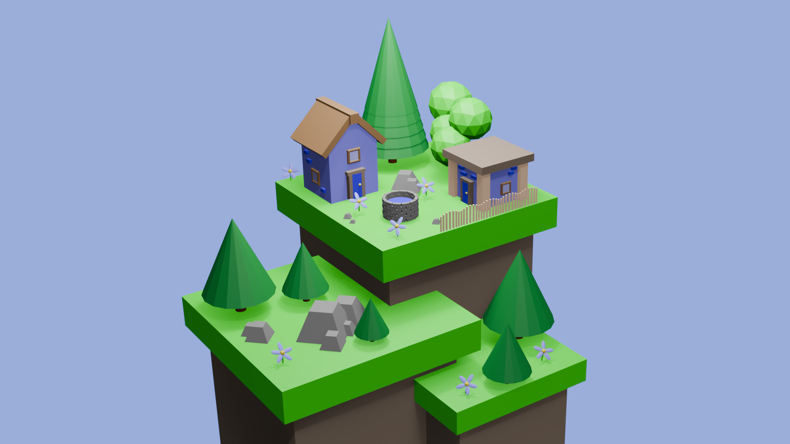

## my first project in blender

This is my very first Blender project! It features two cozy houses surrounded by flowers and a tree, created as a practice scene to explore basic modeling, texturing, and rendering in Blender.




## version  management flow
use `git lfs` for blender:
```
git lfs install
```

Tell Git LFS to manage .blend files:
```bash
git lfs track "*.blend"
```

This creates a `.gitattributes` file in your repo. Make sure to commit it:
```
git add .gitattributes
git commit -m "Track .blend files with Git LFS"
```

now you can commit normally:
```
git add your_project.blend
git commit -m "Add Blender project"
```
